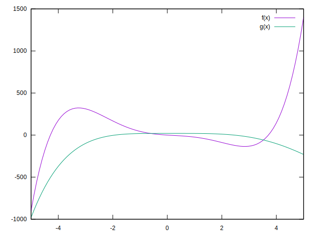

 
 

---

# はじめに

*このオンラインブックは執筆中です。完成版ではありません。[フィードバック](https://docs.google.com/forms/d/e/1FAIpQLSd5NN8awATTEVN4kI_itnnJRNdEEgkoEnRFLuUaoxmLBgJZZQ/viewform?usp=header) はこちらからお願いいたします。2025年6月の完成を目指しています。現在は推敲と校正前ですので、誤字脱字や文章におかしな部分がありますが、ご容赦ください*

本書では、アセンブリ言語にコンパイルされたプログラムの実行を証明する仮想マシン、つまりzkVMを作成を通して、ゼロ知識証明について学びます。

zkVMにはパラダイムがありますが、その中でも比較的理解しやすいものを選びました。本書だけではzkVMの全てを知ることはできませんが、ここで得られた知識はゼロ知識証明の世界に飛び込む読者の足がかりになるはずです。一見、難しそうに見える数式やコードが出てきますが、全てステップ・バイ・ステップで説明していきます。分からないと感じたらぜひ前の章に戻ってみてください。

この本では、理論と実装のパートが分かれています。もし、理論の途中でわからなくなってしまったら、再度上から読み直して、理解できるところまで実装してみてください。手を動かしてみると、より理解が深まりその先へと進めると思います。また、この時代はChatGPTのようなLLMに質問することも理解の手助けになると思いますので、ぜひ活用してみてください。

この本の読者は数学やプログラムが得意である必要はなく、むしろパズルの解き方を頭の中や紙の上で時間をかけて理解できれば十分です。なぜなら、私たちは新しい研究をするのではなく、すでに答えがある問いに対して、その解き方を理解できれば十分だからです。

また、本書の理解には必要ないが重要な概念や補足、こぼれ話はコラムとしてまとめていきますので、身構えず気楽に読み進めてください。

###  なぜzkVMなのか

ゼロ知識証明を知るのに、なぜzkVMを題材に選んだのでしょうか？これは、近年のゼロ知識証明の研究が、どのようにzkVMを作るかという方向で活発化しているからです。そもそもVMとはVirtual Machineのことで、仮想機械、つまりプログラム上でCPUなどのハードウェアをシミュレートし、さらにその上でプログラムを動かすという階層高構造になる仕組みのことです。ゼロ知識証明では複雑な計算を証明したいわけですが、基本的には証明のプロトコルによって書き方が異なります。

計算そのものをどう分かりやすく表現するかが問題になりますが、これにはいくつか方法があります。一つは専用の言語を作ってその言語でプログラムを直接書くことです。しかし、プログラマは既存のプログラムを専用言語でいちいち書き直したくないですし、ツールによって言語を使い分けることも認知的なコストが高くなりがちです。

一般的なプログラミング言語を専用言語に変換する、といった方法もありますが、プログラミング言語もバージョンによって書き方が微妙に異なりますし、全てに対して専用のコンパイラを用意するのもコストに見合うかわかりません。

そこで、既存のどのプログラミング言語からもコンパイルできて、変更が滅多に行われない言語、つまりアセンブリ言語そのものを証明してしまおう、ということです。アセンブリ言語で書かれた計算を証明するには、CPUそのもの挙動をゼロ知識証明のフォーマットで一度だけ定義し、どんなプログラムに対しても同じゼロ知識証明の回路を使い回せばいいのです。すると、プログラマも普段の業務と同じように好きな言語でプログラムを書き、自然とその計算が証明されるわけです。

###  zkVMのパラダイム

zkVMはあくまでも「やりたいこと」であって、実際にどのような実装かを指す言葉ではありません。実装にはいくつかのパラダイムがあります。一つはプログラムの実行を一つの大きな証明回路にして、一度に証明しまう方式です。もう一つはプログラムの実行を小さなステップに分けて証明回路を繰り返し適用することで再帰的に証明する方式です。

前者をモノリシック（Monorithic）方式といい、後者をリカーシブ（Recursive）方式といいます。Monorithicで代表的なものはJolt/Lasso方式ですが、入門には難しすぎるので、比較的わかりやすいRecursiveのNova方式を本書では採用します。さらに、Novaの中でもわかりやすく今後の発展の基本となりそうなHyperNovaをベースに解説していきます。とくに、HyperNovaで使われる技術はJoltでも使われるものが多く、学ぶと他にも応用が効きます。

::::{.note}
コラム: ゼロ知識証明の回路

ゼロ知識証明の中でもSNARKという分野では、計算をひとまとまりにした単位を回路と呼びます。面白いことにzkVMは、CPUを二進数のANDやORの論理回路から、有限体のADDやMULの証明回路で書き直していく作業になります。ある意味でzkVMは、論理演算を使わない別の世界のコンピューターをいえるかもしれません。

::::

::::{.note}
コラム: Novaの一族

Novaは高速なRecursive方式として、2021年ごろに登場しました。その後も改良が登場しましたが、それらの名前はオリジナルのNova（新星爆発）にちなんで付けられていきました。

最初に登場したのがSuperNova（超新星爆発）です。その後すぐにHyperNova（極超新星爆発）が提案され、さらにその後すぐに二つを組み合わせたSuperHyperNovaなんていうのも提案されかけました。

爆発のインフレーションはすぐに終わりましたが、現在でもNeutronNova（中性子新星爆発?）のような〇〇Novaという名称や、Nebula（星雲）や ProtoStar（原始星）など宇宙にちなんだ名前が付けられています。

あなたのzkVMにも宇宙や星に関連する名前をつけてみるのも面白いかもしれません。

::::

### 本書の想定する開発環境 *執筆中*

### 著者について

ClankPan ([@ClankPan](https://x.com/ClankPan))。NovaNet という zkVM 開発企業で働いており、仕事としては直接ゼロ知識証明に携わってはいないものの、個人的に勉強しながら業界の動向を追っています。

まだ黎明期にある zkVM は、ゼロ知識証明の中でも特に注目されるトピックですが、網羅的に学べる日本語の解説はほとんどありません。そこで、私自身の勉強の過程で得た知見をまとめようと思い、この書籍の執筆を始めました。

書籍のフォーマットは私の尊敬する植山類さんの「[低レイヤを知りたい人のためのCコンパイラ作成入門](https://www.sigbus.info/compilerbook)」のフォーマットをお借りしました。

この書籍が、zkVM やゼロ知識証明に興味を持った日本の皆さんの学習に少しでも役立てば幸いです。

また、本書の内容を題材とした勉強会や講演のご依頼なども歓迎します。興味のある方はお気軽にお声がけください。皆さんと学びを共有しながら、zkVM やゼロ知識証明の面白さをより多くの方にお伝えできれば幸いです。

 

---

# ゼロ知識証明と計算圧縮

ゼロ知識証明というのは、その名の通り、「自分が持っている情報を明かさず、持っていることだけを証明する」技術の総称です。自分が隠したい情報を秘匿することが主な内容ですが、最近は計算量を圧縮することができる特性が注目されています。

たとえば、ブロックチェーン上で何かを計算させると、その計算量に応じてとにかく支払うコストが莫大にかかります。そこで、少しでも計算量と通信を減らしたいという動機が生まれ、この技術に注目と投資が集まるようになりました。これが近年急速にゼロ知識証明の研究が進んでいる理由です。

::::{.note}
コラム: SNARK

情報を秘匿しなくてもいいから計算が正しいことを証明したい、という需要があります。これを他のゼロ知識証明と区別するため、SNARK（スナーク）と名付けられました。

サイズの証明が短く (succinct) 、やり取りが一度きり (non-interactive) という意味です。さらに、ゼロ知識性がある場合はzkSNARKとZero Knowledgeの頭文字であるzkを先頭につけます。

::::

## 解と検証の計算

計算量を圧縮できるとはどういうことでしょうか。これは、問題を解く計算量と答えを検証する計算量が対等ではない、というありふれた問題として考えることができます。

たとえば、ソートを例に考えてみましょう。数字を順列に並び替える計算は、数列が順列であることを確かめるよりも多くの計算を必要とします。並び替え単純な方法は、最初の数字が右の数字よりも小さいかを比較して、大きければ入れ替える、という計算を全ての数字が満たすまで繰り返していきます。

一方で、数字が全て小さい順に並んでいるのを確かめるだけなら、左から順に数字を比較していくだけなので、数字の個数分の計算だけで済みます。つまり、100個の数字があるとすれば、ソートにはざっくり660回程度の計算が必要になりますが、確かめるには100回程度だけです。

このように、解く計算量よりも検証する計算の方が小さい、といった問題はありふれています。もし仮に、プログラムなどの計算をソートの解を求めることに置き換えることができるのなら、プログラムの計算が正しいかは、解が順列であるかを確かめるだけです。

ソートはあくまでも例えなので実際の証明には使いませんが、大きく分けて

1. 計算をとある問題の解を求めることへ変換して証明、 
2. その問題の解が正しいか検証してもらう、

の二つに分けることができます。

## シュワルツ・ジッペルの補題

ソートの例の代わりに、シュワルツ・ジッペルの補題（Schwartz-Zippel lemma）とSumcheck（合計チェック）いうものを使います。この二つによって、証明者が出した解を、検証者がより少ない計算で検証することができます。

ではいったい、どんな計算を減らすことができるのでしょうか？ それは、式の合計を求める計算です。

シュワルツ・ジッペルの補題とサムチェックを使うことで、証明者は式の合計がとある値になることを伝え、検証がそれが成り立つかを簡単に確かめることができるのです。

### 多項式とは

まずは、多項式が何かについておさらいしていきましょう。多項式とはその名の通り、項（係数 $\times$ 変数）が式中に1つ以上存在する式のことです。たとえば次のような式で、係数 $a,b,c$ と変数 $x,y,z$ からの項がいくつかあることがわかると思います。これらの式はこれ以上、項を減らすことはできません。

$$
\begin{aligned}
f(x) &= ax^2 + bx + c \\[0.8em]
g(x,y,x) &= ax + by + cz \\
\end{aligned}
$$

### 多項式の一致

シュワルツ・ジッペルの補題は、「 *二つの多項式の変数をランダムな値で評価したときに同じ結果になれば、二つが同じ多項式であると見なせる* 」といった定理です。中学や高校の数学の授業で、「二つの式が交わる点を求めよ」という問題を解いたことはないでしょうか？ 2つのグラフは、ほとんどの場所で重ならず、一点か二点だけでしか交わりません。

2つの多項式をグラフにプロットしたときに、交わる点は全体の中では驚くほど少ないということです。なので、全く異なる多項式が、完全にランダムな点で交わる確率は極僅かになります。この確率は適切に設定すれば実用上無視できる確率になります。どれくらいかというと、地球上のすべての砂粒の中から、私がまいた砂の1粒を1回で選び出す確率よりも低くなります。

シュワルツ・ジッペルの補題は、ゼロ知識証明の中でも頻出なので、ぜひ押さえておきましょう。

## 合計値での解の検証

証明者が特定の範囲では常に0になる多項式を見つけることができれば、検証者はその範囲の全ての値の合計も0であることを確かめれば良いのです。これにはサムチェックを使います。では、シュワルツ・ジッペルの補題はどこで出てくるかとういうと、サムチェックの中に出てきます。この辺りは後ほど解説しますので、身構えず読み進めてみてください。

::::{.note}
コラム: 計算量を表すオーダー

これを、オーダー（ $O$ ）という計算量を示す概念を導入して考えてみましょう。計算量は計算によって変化する個数 $N$ が計算の中でどれだけ影響するかで表します。もし、$N$ の数字があって全ての数字を一度だけ見る計算なら、$O(N)$ となります。全ての数字に対して、全ての数字を掛け合わせる計算だとすれば、1つに対して $N$ 回の計算が行われ、それが $N$ 回繰り返されるので、$O(N \times N)$ 、つまり、$O(N^2)$ になります。

ソートには最速でも $O(n\log{n})$ を必要とします。しかし、順列であることを確かめるだけだと、単純に考えても $O(n)$ だけです。

$N$ が小さい時にはそれほど違いを感じませんが、 $N$ が1,000や10,000 などになってくると計算回数にかなりの差が出てきます。

このように、大きな $N$ に対してどれだけ違うか、をみる指標なので、 $3 
\times N$ などの定数は無視して表記します。実際、大きな $N$ に対しては定数がかかっていてもそれほどの差は出ません。
::::

::::{.note}
コラム: 式を評価？

多項式に限らず、式の変数に値で代入して結果を求めることを「評価」するといいます。この単語は英語由来のevaluationを直訳したものなので、日本語にすると少し不思議な感じがします。evaluationには値付けという意味があるので、式の値を求める述語としては少し納得できます。

どちらにしろ、数学の世界では評価という単語が使われていますので、計算する、くらいの意味として覚えておいてください。

::::

 

---

# 計算の記述

証明したい計算、つまりプログラム、を多項式の形で表現できれば、どうやら証明できそうなことが分かってきました。ここからは、計算をどう多項式に変換していくかについて考えていきます。プログラムを含めた色々な種類の計算のフォーマットの全てから直接多項式に変換する方法を考えるのは、非常にコストが高い作業になります。そこで、このような問題を解決するのによく用いられる手法が中間表現です。多様なフォーマットから変換しやすく、目的にフォーマットにも変換しやすい表現を中間に挟むことで、開発のコストを下げるという考え方です。

まずは、このような計算の記述方法についてみていきましょう。

## よく使われる計算の表現方法

プログラムを多項式に変換していく前ステップとして、まずは計算を次のような制約式の連なりで表現していきます。

$$
\alpha \times \beta = \gamma
$$ 

ルールは、 それぞれの項の中にはいくら足し算を入れもていいですが、掛け算は1つの制約式につき一回だけですので、もう一度掛け算が必要な場合は次の式で行います。

たとえば、フィボナッチ数列なら次のようになります。aとbを足した結果がcとなり、次の行ではbとcが足されdとなっています。変数が同じなら、 $1\times c = (a + b)$ でも構いません。

$$
\begin{aligned}
(a + b) \times 1 &= c \\
(b + c) \times 1 &= d \\
(c + d) \times 1 &= e \\
(d + e) \times 1 &= f \\
\end{aligned}
$$

変数に値を入れてみると、次のようになるはずです。この $a$ から $f$ の値が計算の解となるわけです。簡単ですので、合っているか手で計算してみてください。

$$
a = 1, b = 2, c = 3,d = 5,e = 8,f = 13
$$

$ax^3 + b x^2 + cx + d = e$ なら次のようになります。 $x^2$ と $x^3$ はそれ自体が $x$ の掛け算なので、$v,w$ に割り当ててあげて、$ax^3$ などは中間結果として $\alpha$ と置いてあげます。

$$
\begin{aligned}
x \times x &= v \\
x \times v &= w \\
a \times w &= \alpha \\
b \times v &= \beta \\
c \times x &= \gamma \\
(\alpha + \beta + \gamma + d) \times 1 &= e
\end{aligned}
$$

この表現方法でプログラムのすべてを書き出すのは少々骨が折れる作業ですが、全くできないという程でもありません。また、変換するツールなどもあるので、それらを使えば好きなプログラムをこの形式に直すこともできます。先ほど説明した専用言語やコンパイラのことです。

浮動小数点数やビット演算などの表現が難しいものは、別の技術を使ってカバーします。

::::{.note}
コラム: ルックアップ

ビット演算などの論理演算を、このような代数演算的な表現に落とし込むのはとても大変です。たとえば、変数が $0,1$ のどちらかであることを制約する式を考えてみましょう。次の式が成り立つのは $x$ が $0,1$ のときのみです。

$$
(1-x) \cdot x = 0
$$

このようにして、1つの変数に1つのビットを割り当てていくことができますが、32bitを表現するだけで30以上の制約式が必要となってしまいます。

このように、コンピュータ上で行われる全ての式を代数的な表現に置き換えることは証明コストの面から難しいため、通常は別の方法が使われます。それがルックアップです。

ビット演算などの計算に対して、あらかじめ答えが記録された表を作っておき、表に対して正しい入出力が行われたかだけを制約します。

::::

::::{.note}
コラム: 中間表現 IR

中間表現のことを一般に IR（Intermediate Representation）といいます。この用語はプログラミング言語の世界でよく使われるもので、様々なな言語から多様なCPUに対して言語を変換する際によく考えらます。特に、CPUの命令セットよって機械語が大きく異なるので、IRは必須です。もしIRがなければ、この世には「言語の種類 $\times$ 命令セットの種類」だけのコンパイラが生まれてしまいます。

一番有名なIRは、LLVMでしょう。LLVMは抽象的な命令セットで、ここから多くのアーキテクチャ向けに変換することが可能です。多くのプログラミング言語のコンパイラは、このLLVMのIR向けに言語を翻訳することで、多くのCPUへの対応をサポートしているのです。

現実の世界でも、英語がこのような役割を持つことがあります。

*執筆中: 英語、機械翻訳の中間言語*

::::

 

---

# 計算の変換

さて、プログラムを単純な形で表現することができましたので、次は証明できる形へ変換していきます。特に、$a,b,c,d,v,w,x,..$ などの変数は、文字的に同じ変数と見なしているだけで、それらが同じであるかを制約するものは何もありません。

変数を束縛して、同じ変数をそれぞれの制約式で使われたものと同じであることを式として表現するには、行列の積を使います。行列の積を使えば綺麗に変数の束縛を表せるのですが、残念ながら私たちが使う証明には行列を使うことができません。そのため、行列の積をさらに多項式に変換してあげる必要があるのです。

## 行列の式へ変換

このような変数の使い回しを式で表現するには、行列の掛け算を使います。まずは、行列について少し触れます。

### 行列とは

行列と聞くと数学の難しい概念を想像してしまうかもしれません。しかし、実際には数字を縦と横に並べただけの表です。たとえば、これは、「2行 $\times$ 3列」の行列です。縦に2つ、横に3つの数字が並んでいます。

$$
\begin{bmatrix}
1 & 2 & 3 \\
4 & 5 & 6 \
\end{bmatrix}
$$

- 行 (row): 横方向のまとまり
- 列 (column): 縦方向のまとまり

上の例なら、1行目が $(1,2,3)$ 、2行目が $(4,5,6)$ という感じですね。なぜ行列が必要だというと、情報を整理するための枠組みとして使います。身近な例として、エクセルでデータを整理するシーンを思い浮かべてみてください。「行 $\times$ 列」の表で、商品名や個数、単価などをまとめますよね。
あれとほぼ同じイメージで、行列は「数の表」として、データをわかりやすく並べることができるのです。

::::{.note}
コラム: マトリックス

*執筆中: 映画, NVidia, 機械学習*

行列は見た目が複雑で数字がたくさん並んでいるので、難しいように見えますが、やることは至ってシンプルです。

ではなぜ行列というものが存在するかというと、

::::

### 行列の掛け算 *執筆中*

行列をただの表として捉えることもできますが、便利な演算のルールが用意されています。

### 変数の切り替え

この行列の積を使って、 $\alpha \times \beta = \gamma$ で表された制約式を変換していきます。

行列の積を使う理由は、「どの変数とどの変数を足し合わせるのか」を表現したいからでした。制約式の中では、 $a,b,c...$ などの変数を使いますが、一つ目の制約式の $c$ と二つの制約式の $c$ が同じものであるかを文字としてしか表現できていません。

$$
\begin{aligned}
(a + b) \times 1 &= c \\
(b + c) \times 1 &= d \\
(c + d) \times 1 &= e \\
(d + e) \times 1 &= f \\
\end{aligned}
$$

行列の掛け算をうまく利用すると、変数同士の足し算をうまく表現することができます。どの変数とどの変数を足し合わせるのか、これを先ほどのフィボナッチの例で見てみましょう。変数 $a$ と変数 $b$ が足されています。

$$
(a + b) \times 1 = c
$$

まずは、計算に使われた変数 $a$ から $f$を全て列挙します。それを $0,1$ で構成された行列に掛けています。

$$
\begin{aligned}
\begin{bmatrix}
1 & 1 & 0 & 0 & 0 & 0 & 0 & 0 \\
\end{bmatrix}
\cdot
\begin{bmatrix}
a \\
b \\
c \\
d \\
e \\
f \\
0 \\
1 \\
\end{bmatrix}
&=
\begin{bmatrix}
(a + b) \\
\end{bmatrix} \\
\end{aligned}
$$

1番目と2番目が $1$ になっているので、$a$ と $b$ が選択され足されています。詳しく書くとこんな感じです。行列の掛け算の規則によって、うまいこと足し合わせたい変数だけが残ってることがわかると思います。

$$
(1 \cdot a) + (1 \cdot b) + (0 \cdot c) + (0 \cdot d) + (0 \cdot e) + (0 \cdot f) + (0 \cdot 0) + (0 \cdot 1)
$$

これを拡張して、要素が $0,1$ で構成された $m \times n$ 行列 $A$ と、すべての変数が列挙された $n \times 1$ 行列 $Z$ を定義します。二つの行列を掛けると、

$$
\begin{aligned}
A \cdot Z &=
\begin{bmatrix}
1 & 1 & 0 & 0 & 0 & 0 & 0 & 0 \\
0 & 1 & 1 & 0 & 0 & 0 & 0 & 0 \\
0 & 0 & 1 & 1 & 0 & 0 & 0 & 0 \\
0 & 0 & 0 & 1 & 1 & 0 & 0 & 0 \\
\end{bmatrix}
\cdot
\begin{bmatrix}
a \\
b \\
c \\
d \\
e \\
f \\
0 \\
1 \\
\end{bmatrix}
&=
\begin{bmatrix}
a + b \\
b + c \\
c + d \\
d + e \\
\end{bmatrix} \\
\end{aligned}
$$

フィボナッチ数列の制約式のうち、$\alpha$ のすべての項の集合になっていることがわかります。 $\beta , \gamma$ についても、次のように変数を選び、その和をとります。ただし、フィボナッチ数列では $\alpha$ 以外では和を取らないので、ただ変数を選択しただけになっています。

$$
\begin{aligned}
B \cdot Z &=
\begin{bmatrix}
0 & 0 & 0 & 0 & 0 & 0 & 0 & 1 \\
0 & 0 & 0 & 0 & 0 & 0 & 0 & 1 \\
0 & 0 & 0 & 0 & 0 & 0 & 0 & 1 \\
0 & 0 & 0 & 0 & 0 & 0 & 0 & 1 \\
\end{bmatrix}
\cdot
\begin{bmatrix}
a \\
b \\
c \\
d \\
e \\
f \\
0 \\
1 \\
\end{bmatrix}
&=
\begin{bmatrix}
1 \\
1 \\
1 \\
1 \\
\end{bmatrix}\\
\\
C \cdot Z &=
\begin{bmatrix}
0 & 0 & 1 & 0 & 0 & 0 & 0 & 0 \\
0 & 0 & 0 & 1 & 0 & 0 & 0 & 0 \\
0 & 0 & 0 & 0 & 1 & 0 & 0 & 0 \\
0 & 0 & 0 & 0 & 0 & 1 & 0 & 0 \\
\end{bmatrix}
\cdot
\begin{bmatrix}
a \\
b \\
c \\
d \\
e \\
f \\
0 \\
1 \\
\end{bmatrix}
&=
\begin{bmatrix}
c \\
d \\
e \\
f \\
\end{bmatrix} \\
\end{aligned} \\
$$

最終的に、行列の式で表すと、次のようになります。 $\circ$ 記号は アダマール積（Hadamard Product）といって、重なり合う要素の掛け算だけをする演算記号です。普通の行列の掛け算は $\cdot$ 記号で表されます。

$$
\begin{aligned}
A \cdot Z \quad \circ \quad B \cdot Z  \quad &= \quad C \cdot Z  \\
\\
\begin{bmatrix}
a + b \\
b + c \\
c + d \\
d + e \\
\end{bmatrix}
\quad
\circ
\quad
\begin{bmatrix}
1 \\
1 \\
1 \\
1 \\
\end{bmatrix}
\quad
&=
\quad
\begin{bmatrix}
c \\
d \\
e \\
f \\
\end{bmatrix} \\
\end{aligned}
$$

行列を使うことで、どの変数をどう使うかを表現することができました。この表現方法はR1CS（Rank-1 Constrain System）と呼ばれます。

::::{.note}
コラム: 中間表現の中間表現 CCS

*執筆中: R1CS以外の中間表現, AIR, CCS*

::::

::::{.note}
コラム: 似て非なる、行列の式と行列式

一般的には「行列方程式 (matrix equation)」または「行列演算式 (matrix expression)」と呼びます。

「行列式 (determinant)」 は、行列から 1つのスカラー値（数）を計算する別の概念で、縦棒 |..| で書かれます。

*執筆中: *

::::

## 多項式への変換

ここまでで、プログラムを制約式で表現し、さらに変数の束縛を行列の積で表現することができました。しかし、私たちが使う証明の方法では、行列の式を直接証明することができません。

そこで、行列の積で表現した変数の束縛を変えずに、行列の積そのものを多項式で表現します。

まずは、行列の積のルールについておさらいしましょう。二つの行列をかけるには、左の行列の「行（縦）」と右の行列の「列（横）」の要素をかけて足します。

行列の積の規則は複雑ですが、中身は掛け算の足し算のみですので、適切に分解してあげれば難しいことはありません。行列の $i$ 行目 $j$ 列目 を取り出す記号 $[i,j]$ を使って、上の行列の掛け算を表してみると、次のようになります。

$$
M1 = 
\begin{bmatrix}
1 & 2 & 3 \\
4 & 5 & 6 \\
\end{bmatrix},
\quad
M1 = 
\begin{bmatrix}
7 \\
8 \\
9
\end{bmatrix},
\quad
M3 = 
\begin{bmatrix}
(1 \cdot 7) + (2 \cdot 8) + (3 \cdot 9) \\
(4 \cdot 7) + (5 \cdot 8) + (6 \cdot 9) 
\end{bmatrix},
$$

$$
M3 = 
\begin{bmatrix}
(M1[0,0] \cdot M2[0]) + (M1[0,1] \cdot M2[1]) + (M1[0,2] \cdot M2[2]) \\[0.8em]
(M1[1,0] \cdot M2[0]) + (M1[1,1] \cdot M2[1]) + (M1[1,2] \cdot M2[2]) 
\end{bmatrix},
$$

行列 $M3$ は、$M1, M2$ の要素の指定と、掛け算・足し算で表現できることがわかります。しかし、このような書き方は少し冗長ですので、合計の演算記号 $\sum$ を導入して記述してみます。

$$
M3 = 
\begin{bmatrix}
\sum_{j=0}^{2}{M1[0, j] \cdot M2[j]} \\[0.8em]
\sum_{j=0}^{2}{M1[1, j] \cdot M2[j]}
\end{bmatrix}
$$

式の意味は、「 $j$ を $0$ から $2$ まで変化させたときの要素の積の合計」となります。仮に、 $M3$ の最初の行だけを取り出すなら、このように書けばいいわけです。

$$
\sum_{j=0}^{2}{M1[0, j] \cdot M2[j]}
$$

証明で使えるような多項式に行列の積を変換する方向性が見えてきました。いくつか馴染みのない記号（$\sum$ や $[i,j]$ ）が出てきたので、それらの使い方について軽く触れましょう。

### 全ての合計を求める記号 $\sum$

$\sum$ の基本的な使い方は、「下に定義された変数を上に書かれた範囲まで順番に変化させていき、全てを足し合わせる」ように式を展開する記号です。例えば、 $f(x)$ を $1$ から $3$ まで評価した時の合計を求める式を作りたければ、次のように書くことができます。

$$
f(1) + f(2) + f(3) \quad \rightarrow \quad  \sum_{i=1}^{3}{f(i)} 
$$

### 要素を取り出す記号 $M[i,j]$

$M[i,j]$ の使い方は、「行列 $M$ の $i$ 行 $j$ 列の要素を取り出して置き換える」ように式を展開する記号です。例えば、 $m \times n$ サイズの行列 $M$ のすべての要素を足し合わせるのであれば、この記号 $[i,j]$ を使うと、次のようになります。

$$
M[0,0] + M[0,1] + ... + M[1,1] \quad \rightarrow \quad \sum_{i=0}^{m-1} \; \sum_{j=0}^{n-1}{M[i,j]} 
$$

### 制約式のおさらい

行列の式を多項式に変換するのは、証明に適した形にしたいからでした。ここまでをいったん整理してみましょう。フィボナッチ数列の制約式は、次のような式でした。

$$
\begin{aligned}
(a + b) \times 1 &= c \\
(b + c) \times 1 &= d \\
(c + d) \times 1 &= e \\
(d + e) \times 1 &= f \\
\end{aligned}
$$

また、これを行列で表すとこうなります。行列を使う理由は、変数の束縛を表現できるからでした。

$$
(A \cdot Z ) \circ (B \cdot Z) = C \cdot Z
$$

$$
\begin{aligned}
\left(
\begin{bmatrix}
  1 & 1 & 0 & 0 & 0 & 0 & 0 & 0 \\
  0 & 1 & 1 & 0 & 0 & 0 & 0 & 0 \\
  0 & 0 & 1 & 1 & 0 & 0 & 0 & 0 \\
  0 & 0 & 0 & 1 & 1 & 0 & 0 & 0 \\
  \end{bmatrix}
  \cdot
  \begin{bmatrix}
  a \\
  b \\
  c \\
  d \\
  e \\
  f \\
  0 \\
  1 \\
  \end{bmatrix}
\right)
\circ
\left(
  \begin{bmatrix}
  0 & 0 & 0 & 0 & 0 & 0 & 0 & 1 \\
  0 & 0 & 0 & 0 & 0 & 0 & 0 & 1 \\
  0 & 0 & 0 & 0 & 0 & 0 & 0 & 1 \\
  0 & 0 & 0 & 0 & 0 & 0 & 0 & 1 \\
  \end{bmatrix}
  \cdot
  \begin{bmatrix}
  a \\
  b \\
  c \\
  d \\
  e \\
  f \\
  0 \\
  1 \\
  \end{bmatrix}
\right) 
\\
\\ = 
\left(
\begin{bmatrix}
0 & 0 & 1 & 0 & 0 & 0 & 0 & 0 \\
0 & 0 & 0 & 1 & 0 & 0 & 0 & 0 \\
0 & 0 & 0 & 0 & 1 & 0 & 0 & 0 \\
0 & 0 & 0 & 0 & 0 & 1 & 0 & 0 \\
\end{bmatrix}
\cdot
\begin{bmatrix}
a \\
b \\
c \\
d \\
e \\
f \\
0 \\
1 \\
\end{bmatrix}
\right) 
\end{aligned}
$$

### 行列の積の $i$ 行目

この式は、行列 $A \cdot Z$ の結果の $i$ 行目の要素になります。

$$
\sum_{j=0}^{7}{A[i,j] \cdot Z[j]}
$$

では、$0$ 行目が実際にどうなるか一緒に式を展開してみましょう。

$$
\begin{aligned}
&\sum_{j=0}^{7}{A[0,j] \cdot Z[j]} \\
\\
& = A[0,0] \cdot Z[0] + A[0,1] \cdot Z[1] \\
& + A[0,2] \cdot Z[2] + A[0,3] \cdot Z[3] \\
& + A[0,4] \cdot Z[4] + A[0,5] \cdot Z[5] \\
& + A[0,6] \cdot Z[6] + A[0,6] \cdot Z[6] \\
& + A[0,7] \cdot Z[7] + A[0,8] \cdot Z[8] \\
\\
&= (1 \cdot a) + (1 \cdot b) \\
&+ (0 \cdot c) + (0 \cdot d) \\
&+ (0 \cdot e) + (0 \cdot f) \\
&+ (0 \cdot 0) + (0 \cdot 1) \\
\\
&= a + b
\end{aligned}
$$

ここまでの、合計する記号 $\sum$ と要素を取り出す記号 $M[i,j]$ を使うと、行列の式の $i$ 行目の結果を表すことができるようになります。

$$
\sum_{j=0}^{7}{A[i,j] \cdot Z[j]} \quad \cdot \quad \sum_{j=0}^{7}{B[i,j] \cdot Z[ij]} \quad = \quad \sum_{j=0}^{7}{C[i,j] \cdot Z[j]}
$$

この式はつまり、 $i$ 行目の掛け算のことなので、 実際に $i=0$ で展開してみると、次が成り立つことがわかります。

$$
\begin{aligned}
&\sum_{j=0}^{7}{A[0,j] \cdot Z[j]} \quad \cdot \quad \sum_{j=0}^{7}{B[0,j] \cdot Z[ij]} \quad - \quad \sum_{j=0}^{7}{C[0,j] \cdot Z[j]} \\[0.8em]
&= (a + b) \cdot 1 - c \\[0.8em]
&= 0
\end{aligned}
$$

お気づきかもしれませんが、 $0$ 行目のこの式は、フィボナッチ数列の 1つ目の制約式と一致しています。つまり、 $i$ が $0$ から $3$ のどれも、式はゼロとイコールになるのです。

$$
\begin{aligned}
(a + b) \times 1 &- c = 0 \\
(b + c) \times 1 &- d = 0 \\
(c + d) \times 1 &- e = 0 \\
(d + e) \times 1 &- f = 0 \\
\end{aligned}
$$

### 行列の積を多項式で表現

ここまでは、 $i$ 行 $j$ 列の要素を取り出すのに、記号 $[i,j]$ を使っていましたが、これは多項式ではありません。単に、式を展開するときに定数をどこから取ってくるかを指定しているにすぎません。

最終的な証明には、全てが多項式でなければならないので、記号 $[i,j]$ も多項式で表されなければなりません。そこで、  $x$ 行 $y$ 列の要素を取り出す多項式 $A(x,y)$ を考えます。

- $A[i,j]$  : 「要素を取り出す記号」
- $A(x,y)$  : 「要素を取り出す多項式」

$$
\begin{aligned}
&f(x) = \sum_{y=0}^{7}{A(x,y) \cdot Z(y)} \quad \cdot \quad \sum_{y=0}^{7}{B(x,y) \cdot Z(y)} \quad - \quad \sum_{y=0}^{7}{C(x,y) \cdot Z(y)}
\end{aligned}
$$

$A(x,y)$ などをどう作るかは置いておいて、$f(x)=0$ の形に近くなってきました。この式は、$0$ から $4$ の区間なら $f(x)$ がゼロになります。証明を行うサムチェックは、ある区間の合計が0になることを証明できるので、最終的にこの形に持っていければよさそうです。計算を多項式へと変換する工程もいよいよ最後の段階になりました。

### 要素を取り出す多項式 $M(x,y)$

$A(x,y)$ を作るにはどうしたらいいでしょうか？　まずは変数が1つの$Z(x)$ から考えてみることにします。

$Z$ 、つまり $[a,b,c,d,e,f,0,1]$ からn番目の要素を取り出すのは、先ほどの $\{0,1\}$ を掛け合わせるテクニックを使います。取り出したい要素だけ1にして、それ以外は0にするという方法です。

$$
\begin{aligned}
Z(x_1, x_2, x_3, x_4, x_5, x_6, x_7, x_8) &= (x_1 \cdot a) + (x_2 \cdot b) \\
&+ (x_3 \cdot c) + (x_4 \cdot d) \\
&+ (x_5 \cdot e) + (x_6 \cdot f) \\
&+ (x_7 \cdot 0) + (x_8 \cdot 1)
\end{aligned}
$$

使い方は、3番目の要素を取り出したければ、3つ目の変数のみを $1$ にすればいいのです。

$$
Z(0,0,1,0,0,0,0,0) = c
$$

しかし、これでは変数の数が多い上に、2つ以上を選択してその合計値を取ってくることが出来てしまします。そこで、$Z$ の $n$ 番目の要素を指定するのに、二進数で渡せるようにします。これだと、要素が8個ならば3つの変数だけでよく、さらに同時に1つの要素しか選択できません。この二進数をうまいこと ${0,1}$ となる係数に変換できればいいのです。

3は二進数では $0b011$ ですので、このような感じで3つ目の要素を指定できれば、いいわけです。

$$
Z(0,1,1) = c
$$

用意するのは、2つの二進数が一致すれば $1$ , 異なれば $0$ になる多項式です。これは次のように作ることができます。 $\prod$ は $i$ を増やしていって、その積をとる演算記号です。 $\sum$ の掛け算バージョンだと思ってください。

$$
eq((x_1, x_2, x_3), (y_1, y_2, y_3)) = \prod_{i=1}^3{(1-x_i)(1-y_i) + x_i y_i}
$$

3bitはここに書くのは長いので2bitにしますが、展開するとこのようになります。ビットが違う項はゼロになるので、一つでもゼロになれば掛け算によって結果もゼロになります。

$$
\begin{aligned}
eq((1,0), (1,0)) = \{(1-1)(1-1) + 1 \cdot 1 \} \cdot   \{(1-0)(1-0) + 0 \cdot 0 \} &= 1, \\[0.8em]
eq((0,1), (1,1)) = \{(1-0)(1-1) + 0 \cdot 1 \} \cdot   \{(1-1)(1-1) + 1 \cdot 1 \} &= 0, \\
\end{aligned}
$$

ということで $eq$ を使えば、 $Z$ は次のように書くことができます。式の中に $(x_1, x_2, x_3)$ を毎回書くのは大変なので $X$ としていますが、同じものです。

$$
\begin{aligned}
Z(X) &= a \cdot eq(X, (0,0,0)) + b \cdot eq(X, (0,0,1)) \\[0.8em]
&+ c \cdot eq(X, (0,1,0)) + d \cdot eq(X, (0,1,1)) \\[0.8em]
&+ e \cdot eq(X, (1,0,0)) + f \cdot eq(X, (1,0,1)) \\[0.8em]
&+ 0 \cdot eq(X, (1,1,0)) + 1 \cdot eq(X, (1,1,1))
\end{aligned}
$$

これを定義にしてみましょう。 少し複雑なので順を追って説明していきます。 $y\in \{0,1\}^{\log N}$ は言葉にするなら、「Nをビットで表したときのすべてのパターン」です。$Z[X]$ は定数なので式を展開したときには実際の値が入ります。つまりこの式は、 $X$ と $y$ のビットが一致するとき、それに対応する $Z$ の要素を取り出す、ということになります。

$$
Z(X) = \sum_{y\in \{0,1\}^{\log N}}{Z[X] \cdot eq(X, y)}
$$

例えば、このようになります。

$$
\begin{aligned}
Z((0,0,0)) &= a, \\[0.8em]
Z((0,0,1)) &= b, \\[0.8em]
Z((0,1,0)) &= c, \\[0.8em]
\end{aligned}
$$

$A,B,C$ も同じように定義することができまが、行と列の二つを指定する必要があるので、それぞれの要素に対して $eq$ を二つかけてあげます。

$$
A(X_1, X_2) = \sum_{y_1\in \{0,1\}^{\log M}} \sum_{y_2\in \{0,1\}^{\log N}}{A[X_1, X_2] \cdot eq(X_1, y_1) \cdot eq(X_2, y_2)}
$$

$eq$ をベースに作った多項式は嬉しい性質があるので、他と区別できるようこれ以降は $\tilde{Z}(\cdot),\tilde{A}(\cdot),\tilde{B}(\cdot),\tilde{C}(\cdot)$ と表記しておきます。

::::{.note}
コラム: 多重線形拡張 MLE

$eq(x,y)$ をベースに作った多項式のことを MLE (Multi Linear Extension（多重線形拡張）)といいます。

*執筆中*
::::

### 制約式を表す多項式

定義した多項式を一つにまとめます。

$$
\begin{aligned}
G(X) &= \sum_{y\in \{0,1\}^{\log N}} \tilde{A}(X, y) \cdot \tilde{Z}(y) 
\cdot \sum_{y\in \{0,1\}^{\log N}} \tilde{B}(X, y) \cdot \tilde{Z}(y)
- \sum_{y\in \{0,1\}^{\log N}} \tilde{C}(X, y) \cdot \tilde{Z}(y) \\
\\
&X \in \{0,1\}^{\log M}
\end{aligned}
$$

この $G$ は $X$ の全てのパターンで $G(X) = 0$ が成り立つはずです。もしどれか一つでも $0$ でなければ、それは不正な操作が行われ、 $a \times b = c$ のどこかが間違っているということになります。例えば、 $3 \times 2 = 5$ のような式が含まれているということです。

行列の行数 $M = 4$ なら変数は2つで、次のようになります。

$$
G((0,0)) = G((0,1)) = G((1,0)) = G((1,1)) = 0
$$

### 合計でもゼロ

全て $0$ になるのなら、合計も $0$ であるはずなので、一つの式にまとめることができます。
$$
\sum_{y\in \{0,1\}^{\log M}} G(y) = 0
$$

しかし、例えば、$G((0,0)) = 1, G((0,1)) = -1$ だとすると、お互いを打ち消してしまい、合計として $0$ になることを防げません。

そこで、$G$ にランダムな係数をかけて、打消し合う可能性を小さくするという発想が考えられます。

$$
\begin{aligned}
&\sum_{y\in \{0,1\}^{\log M}} r_i \cdot G(y) \\[0.8em]
\\
&= r_1 \cdot G((0,0)) + r_2 \cdot G((0,1)) + r_3 \cdot G((1,0)) + r_4 \cdot G((1,1)) \\[0.8em]
&= 1 \cdot r_1 + (-1) \cdot r_2 + 0 \cdot r_3 + 0 \cdot r_4\\[0.8em]
&\ne 0
\end{aligned}
$$

だだし、これでは変数がなく、多項式ではなくなってしまうので、次のようにしてあげることで、多項式のままにすることができます。 

$$
\tilde{Q}(\beta) = \sum_{y\in \{0,1\}^{\log M}} G(y) \cdot eq(y, \beta) = 0
$$
式を見ると、$G$ にかかるランダムな係数が、$eq(y, \beta)$ によって変化していくことがわかります。ランダムな値 $\beta$ が $\{0,1\}^s$ でない限りは、 $eq$ がゼロになることはありません。なので、 $eq$ はランダムな変数によって係数が変わり、さらにそれ自体が0にならない、という嬉しい性質があるのです。

例えば、$\beta = (11, 22)$ ならば、次のように展開できます。

$$
\begin{aligned}
\tilde{Q}((11, 22)) &= G((0,0)) \cdot (1-11) \cdot (1-22) \\[0.8em]
&+ G((0,1)) \cdot  (1-11) \cdot 22 \\[0.8em]
&+ G((1,0)) \cdot  11 \cdot (1-22) \\[0.8em]
&+ G((1,1)) \cdot  11\cdot 22 \\
\end{aligned}
$$

### 減らない検証コスト

$\tilde{Q}$ を展開してみるとわかるのですが、$G$ がゼロになるので、$f(x) = 0 \cdot x_1 + 0 \cdot x_2$ のような、全ての項の係数が $0$ となるゼロ多項式となってしまいます。これでは、この多項式を渡された検証者が、何を検証していいか分からず、式の正当性を確かめられません。 $G$ が 本当に $0$ であるかを確かめてもうらうには、$G$ の変数を残さなくてはいけないのです。

そこで、$Q(\beta)$ から合計する前の項を取り出し、 $g(X)$ とします。検証者には、この $g$ が  $\{0,1\}^s$ の全てで $0$ になることを確かめてもらうことで、計算が正しかったと検証してもらいます。

$$
g(X) =  G(X) \cdot eq(X, \beta)
$$

検証者に直接 $g(X)$ を渡して、全パターンを試してもらうこともできますが、それでは計算が減るどころか少し増えてしまいます。

ここで使えるのが、sumcheck protocol です。検証者が全パターンを試すよりも少ないコストで、全てのパターンが $0$ であることを証明することができす。

## ここまでの見取り図 *執筆中*

 

---

# 計算の証明

いよいよ登場しました、Sumcheck Protocol です。 仕組みを言葉で表現するならば、「変数が1つの多項式に分解し、それぞれが同じ多変数多項式がベースであることをランダムな点で検証してもらう。」です。

多変数多項式とは、 $f(x,y,z) = ax + by + cz$ のような変数が複数ある式で、1変数多項式とは  $h(x) = ax + b$ のような変数が一つだけの式の事です。では、なぜ変数ごとに式を分けると計算量が減るかを考えてみましょう。

単純に考えると、3変数多項式なら、$f$ の中の3つの変数の評価を8パターンで試すので、$3 \times 2^3 = 24$ の計算が必要になります。
一方で、3変数多項式を3つの1変数多項式に分解すると、変数を評価は同じく8パターンですが、式中の変数は1つだけなので、 $1 \times 2^3 = 8$ となります。

Sumcheck Protocol では1つの式ごとに3回の評価が必要なだけなので、 $O(N)$ ですが、全パターンを評価するのは $O(N \cdot 2^N)$ となります。

このように、検証者の評価の回数を減らしつつ、適切に元の多変数多項式が分けられているのかを証明するのがこの Sumcheck Protocolの肝なのです。

さらに、サムチェック・プロトコルを使った証明の中にもいくつかのステップがあります。これら三つの証明を組み合わせることで、全体の証明がなされます。今回はサムチェックを使っていますが、このような構成はよくあるので、ぜひ覚えておきましょう。

::::{.note}
コラム: プロトコル

*執筆中:　馴染みのない用語 protocol*

::::

## サムチェック

ではまず、多変数から1変数への変換方法を考えます。ここでは $g(X)$ を取り扱いたいので、ひとまず、 $X = (x_1, x_2)$ としておきます。
検証者には次の3つの多項式と使用したランダムな3つの値 $r1, \beta_1, \beta_2$ を渡します。この $r1$ は検証者から最初にもらったり、改竄できない形で証明者が生成したりします。

$$
\left\{
\begin{aligned}
\quad &g((x_1, x_2)) =  G((x_1, x_2)) \cdot eq((x_1, x_2), (\beta_1, \beta_2)), \\
\\
\quad &g_1(x_1) = \sum_{y \in \{0,1\}}{g((x_1, y))} = g((x_1, 0)) + g((x_1, 1)), \\
\\
\quad &g_2(x_2) = g((r_1, x_2)), \\
\end{aligned}
\right.
$$

検証者は、$g(X)$ が全てのパターンで $0$ になることを $g_1, g_2$ を使って確かめていきます。まず、$g_1(x)$ を使って、$G(X)$ がどのパターンでも $0$ であるという主張を確かめます。この時点では $g_1(x)$ が　$G(X)$ を元に作られているかはまだ検証できていませんが、ひとまず $G(X)$ がゼロになりそうなことは分かりました。

$$
g_1(0) = g_1(1) = 0
$$

なので検証者は、本当に $g_1(x)$ が $G(X)$ の $x_2$ を $0$ と $1$ で評価した多項式であるかを確かめなければなりません。方針は、シュワルツ・ジッペルの補題 を使って、ランダムな点で評価して同じ多項式は同じと見なせる、という性質を使います。つまり、$g_1(x)$ と $G(X)$ を $x_1,x_2$ を $r_1,r_2$ で評価してその結果を比べるということです。

しかし、$g_1(x)$ の内部の $x_2$ はすでに $0,1$ で評価されてしまっているので、$g_2(x)$ を代わりに使います。まずは、$g_1(x)$ と $g_2(x)$ が同じ多項式であるかを確かめましょう。ちなみに、この時点で $g_1, g_2$ の内部で本当に $g$ が使われているか分からないので、$g$ の代わりに $s, s'$ をおいておきます。

$$
\begin{aligned}
g_1(r_1) &= g_2(0) + g_2(1) \\
\\
\sum_{y \in \{0,1\}}{s((r_1, y))} &= s'((r_1, 0)) + s'((r_1, 1))
\end{aligned}
$$

$g_1, g_2$ がどうやら同じ多項式 $s$ を元に作られたということは確かめられました。そして、$g_2$ を使うことで、$G(X)$ と同じ多項式であるかも確かめることができます。これには、 $G$ を $r_1, r_2$ で評価し、その結果を $g_2$ を $r_2$ で評価した結果と比べます。すると、$g_2$ の内部にある $x_1$ は既に $r_1$ で評価されているので、同じランダムな点で二つの多項式を評価し比較することができるのです。

$$
\begin{aligned}
G((r_1, r_2))  &= g_2(r_2) \\
\\
&= s((r_1, r_2)) \\
\end{aligned}
$$

二つが同じ値になるなら、$g_1$ の内部で使われている多項式 $s$ は $G$ と同じなので、$g_1(0) = g_1(1) = 0$ によって、全てのパターンで $G$ がゼロであることも検証できました。

ここまでは $X$ の変数が2つでしたが、3つ以上の場合には 

$$
\begin{aligned}
g_2(r2) &= g_3(0) + g_3(1), \\
g_3(r3) &=  g_4(0) + g_4(1), \\
...
\end{aligned}
$$ 

と検証しいき、$G((r_1, r_2,.., r_n)) = g_n(r_n)$ となることを確かめます。

## 多項式コミットメント

1変数多項式とシュワルツ・ジッペルの補題によって、少ない計算回数によって合計が計算できることが分かりました。しかし、多項式コミットメントを使うと、これよりもまだ検証者の計算を減らすことができます。今の状態では、検証者は証明者から $g_1,g_2,...$ を受け取って、それぞれを乱数 $r_i$ で評価しなければなりません。多項式コミットメントは、この操作を減らすことができるのです。具体的には、証明者が計算した $v_i$ が $g_i(r_i)$ を、 $g_i$ をほとんど知らなくても検証できるのです。

目指すところは、多項式 $P(x)$ を $a$ で評価した結果が $b$ 、つまり、 $P(a) = b$ を $x$ が残る形で式変形して、二つの多項式が一致するかをランダムな点での評価（シュワルツ・ジッペルの補題）で確かめる方向です。

### 多項式の割り算

まずは、式変形した結果をお見せします。この式の意味は、「$P(x) - b = 0$ という式は $(x-a)$ で割り切れ、その時の商は $Q(x)$ である」となります。

$$
P(x) - b = Q(x)(x-a)
$$

この法則は、因数定理といいます。要は、「$f(a) = 0$ ならば、 $f(x)$ は $(x-a)$ で必ず割り切れる」のです。この定理によって、$x$ を残したまま $a,b$ を式の中に入れることができました。

では、実際に計算してみましょう。下の $f(x)$ は $x$ が $3$ のときにゼロになるので、 $(x-3)$ で割り切れるはずです。

$$
f(x) = x^3 - 12x^2 + 47x - 60
$$

$$
\require{enclose}
\begin{align}
	x^2- 9x + 20 \phantom{{} + 0 + 00}\\
	x-3 \hspace{0.5em} \enclose{longdiv}{ \phantom{0} x^3 - 12x^2 + 47x - 60 } \\
	{\underline{x^3 - 3x^2} \phantom{{} 0 + 47x - 60}} \\
  -9x^2   +   47x \phantom{{} + 00}\\
  \underline{-9x^2   +   27x} \phantom{{} + 00} \\
  20x   -   60 \\
	\underline{20x   -   60 } \\
	0
\end{align}
$$

左辺（ $P(x) - b$ ）と右辺（ $Q(x)(x-a)$ ）を同じ $x$ で評価した時に一致すれば、$P(a) = b$ であることも確かめられるのです。

::::{.note}
コラム: 因数定理

*執筆中: 根と因数*

::::

### 離散対数性

$P(x)$ と $Q(x)$ をランダムな $s$ で評価した結果を証明者からもらうことで、検証者は $P_s - b = Q_s(s-a)$ を確かめるだけで良くなります。

しかし、ここで起きる問題は、証明者が事前に $s$ を知っていれば、$a,b$ に全く関係ない $P(x), Q(x)$ をいくらでも作れてしまうということです。またそもそも、 $P_s,Q_s$ を値として受け取ったところで、それが本当に $P(s), Q(s)$ を計算した結果なのかもよく分かりません。

さて、ここから一気に複雑になりますので、頑張ってついてきてください。

まずは、次のような性質を持つ $h(x)$ を導入します。例えば、 $h$ に $3+5$ を入れた結果も $h(3)$ と $h(5)$ を足した結果も同じという性質です。

$$
\begin{aligned}
h(a+b) &= h(a) + h(b), \\
\\
h(ab) &= a \cdot h(b), \\
\end{aligned}
$$

これを利用すると、先ほど例に出した $f(s)$ はこんな感じに変形することができるは分かるでしょうか。

$$
\begin{aligned}
h(f(s)) = 1 \cdot h(s^3) -12 \cdot h(s^2) + 47 \cdot h(s) -60 \cdot h(s^0)
\end{aligned}
$$

ここで、$h(x)$ に重要な性質を追加します。それは、$h(s)$ の結果 $h_s$ からは $h(x)$ の入力となった $s$ は分からないという性質です。これはハッシュ関数にとても似ています。

よって、　$h_{s^0},..,h_{s^3}$ を渡された証明者は $h(f(s))$ の結果 $h_{f(s)}$ を計算することはできますが、$f(s)$ や $s$ が実際にどんな値かを知ることはできないのです。このような性質を離散対数性と言います。

### 検証

検証者は、証明者に $h(P(s))$ と $h(Q(s))$ を計算してもらって、二つが正しいか確かめます。 $a,b$ は証明者が主張した入力と結果で、$s$ は検証者自身が知っています。

$$
h_{P(s)} - h_b = h_{Q(s)} (s - a)
$$

では、この式が成り立つか展開して確かめてみましょう。

$$
\begin{aligned}
h_{P(s)} - h_b &= h_{Q(s)} (s - a) \\[0.8em]
h(P(s)) - h(b) &= h(Q(s)) (s - a) \\[0.8em]
h(P(s) - b) &= h(Q(s)(s - a)) \\[0.8em]
P(s) - b &= Q(s)(s - a) \\
\end{aligned}
$$

もし証明者が $P(a)$ が $b'$ と嘘をついた場合でも、因数定理によって $Q(x)$ を作ることがまずできませんし、次を満たすような偽の $h_{Q'(s)}$ も作ることができません。なぜなら、$s$ を知らないので、検証者が$h_{Q'(s)}$ にどんな値を掛けるか分からず、どんな $Q'$ を用意していいか分からないからです。

$$
h(Q'(s)) \quad \stackrel{?}{=} \quad \frac{h_{P(s)} - h_{b'}}{(s-a)}
$$

このような性質を持つ $h(x)$ をどう作るのかがまだ問題ですが、ランダム評価する $s$ と因数定理によって、検証者が大半の計算をせずに評価結果が正しいことを確かめられるようになりました。実際にはこの性質は楕円曲線上の演算によって得られますが、この章では深く触れません。

### コミットメント

$P(a) = b$ を証明するには、証明者はこの $h_{P(a)}$ と $h_Q(s)$ を検証者に渡せばいいわけですが、 $s, P(x)$ は変わらないので $h_{P(a)}$ を使い回すことができます。

この $h_{P(a)}$ を、$P(a)$ のコミットメントと呼びます。コミットメントは多項式ごとに用意する必要はありますが、同じ多項式の評価を証明する場合は、同じコミットメントを使用します。

## ランダム・オラクル

ここまでで、知られて良い乱数 $r_i, \beta_i$ と、知られてはいけない乱数 $s$ が登場しました。

乱数 $s$ は最後まで秘匿するとして、$r_i, \beta_i$ にかんしては、証明者に作ってもらい検証者が正く生成されたかを確かめるという方法を取ります。これによって、証明者と検証者のやり取りが一回切りになります。一度セットアップした $h_{s^0},h_{s^1},..h_{s^i}$ はこの後もずっと使いまわせるので、あとは証明者が正しい手順で生成した $r_i$ や $g_i$ などを一度に受け取り、検証するだけとなるのです。

ただし、乱数の生成のタイミングには注意が必要です。なぜなら、乱数を本来必要とする前に乱数が何であるかを知られてしまうと、任意の結果となる多項式をいくらでも作れてしまうからです。シュワルツ・ジッペルの補題は、多項式が乱数よりも前に存在することを前提としています。

では、どのように多項式よりも後に乱数を生成させるかというと、多項式のパラメーターやコミットメントをハッシュしたもの乱数としてしまう方法です。事前にハッシュがどのような値になるかを予測して多項式を決めることはできませんので、あとは、検証者が同じコミットメントなどをハッシュに入力して同じ乱数が生成されるかを確認すればいいだけです。

### ハッシュ関数 *執筆中*

## 楕円曲線と有限体 *執筆中*

::::{.note}
コラム: 楕円軌道

*執筆中: 惑星の軌道、ニュートンとケプラー*

::::

::::{.note}
コラム: 楕円曲線暗号

*執筆中*

::::

## サムチェック・プロトコル *執筆中*

## ここまでの見取り図 *執筆中*

 

---

# 計算の畳み込み *執筆中*

## 証明の再帰とは *執筆中*

## 畳み込みとは *執筆中*

## HyperNova *執筆中*

### 多重線形多項式コミットメント *執筆中*

### 2重のサムチェック *執筆中*

 

---

# zkVM  *執筆中*

## CPUの役割 *執筆中*

## 命令の回路　*執筆中*

## オフライン・メモリ・チェック　*執筆中*

## Nebula *執筆中*

## スイッチ・ボード *執筆中*

## ビット演算 *執筆中*

## 浮動小数点数 *執筆中*

## 実行トレース *執筆中*

## *執筆中*

----
- https://eprint.iacr.org/2025/385.pdf
- https://eprint.iacr.org/2025/419.pdf
- https://reilabs.notion.site/Spartan-on-WHIR-15bd2f80c8748076b9c3d427ad443864
- https://eprint.iacr.org/2022/420.pdf
